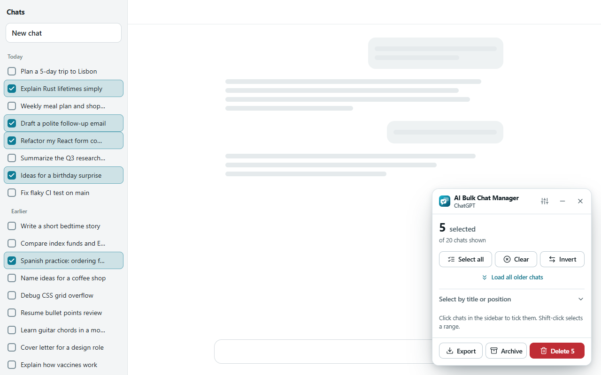
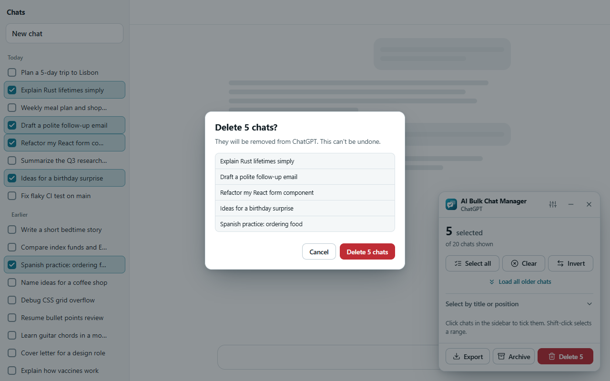
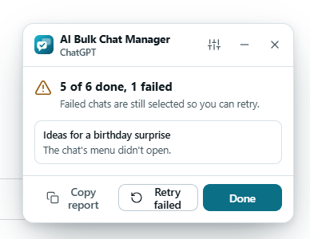

**English** · [فارسی](docs/translations/README.fa.md)

# AI Bulk Chat Manager

**Select many chats. Delete, archive or export them in one go.**

A free, open-source browser extension for ChatGPT, Claude, Gemini and Grok. 
It runs on your device only. No account, no tracking, no server.

[Features](#features) · [Install](#install) · [How it works](#how-to-use-it) · [Privacy](#privacy-and-permissions) · [Safety](#built-to-be-safe) · [FAQ](#faq) · [Contributing](#contributing)

<picture>
  <source media="(prefers-color-scheme: dark)" srcset="docs/assets/screenshots/panel-dark.png">
  
</picture>

## Why

Deleting chats one by one means open the menu, click Delete, confirm, repeat. After a few months you have hundreds. This extension puts a checkbox next to every chat and a small panel in the page, so you tick what you want gone and act on all of it at once.

## Features

| | |
| --- | --- |
| **Floating panel in the page**   It stays open while you click in the sidebar and shows the live count, so you never reopen a popup. Drag it, minimize it, or finish with one click. | **Fast, or by the book**   Fast mode asks the site directly. If that fails, or you turn it off, the extension clicks through the site's own menus like a person. |
| **Select the way you like**   Select all, invert, by title text, the oldest N, Shift-click ranges, and *Load all older chats* to reach your whole history. | **You confirm, every time**   A list of exactly what will change, the safe button focused, and an extra tick for big deletes. |
| **Honest results**   Progress while it works, **Stop** at any time, and a summary. Chats that fail stay selected with the reason, so you can retry. | **Export first**   Save the selected chats' titles and links as JSON, CSV or Markdown before you delete anything. |
| **Archive on ChatGPT**   Archive instead of delete where the site supports it. | **Looks and speaks your way**   Light, dark, four accent colors, 11 languages, right-to-left layouts. |

  
  &nbsp;
  

### Supported sites

| Site | Delete | Archive | Export |
| --- | :---: | :---: | :---: |
| ChatGPT (chatgpt.com) | yes | yes | yes |
| Claude (claude.ai) | yes | – | yes |
| Gemini (gemini.google.com) | yes | – | yes |
| Grok (grok.com) | yes | – | yes |

These sites change their pages without notice. When one does, an action may stop working until the extension is updated; see [FAQ](#faq) and the [issue form for site changes](https://github.com/ehsanenaloo/AI-Bulk-Chat-Manager/issues/new/choose).

## Install

- **Chrome** and other Chromium browsers: [Chrome Web Store](https://chromewebstore.google.com/detail/eppokcmemgiphpegpighpfnhpjggpmoc).
- **Microsoft Edge**: open the Chrome Web Store link above and choose *Allow extensions from other stores*, or load the Chrome package from the [latest release](https://github.com/ehsanenaloo/AI-Bulk-Chat-Manager/releases/latest).
- **Firefox** (140 or newer): download `ai-bulk-chat-manager-<version>-firefox.zip` from the [latest release](https://github.com/ehsanenaloo/AI-Bulk-Chat-Manager/releases/latest) and load it in `about:debugging` as a temporary add-on until it is listed on Firefox Add-ons.
- **From source**: clone this repository and load the `extension/` folder (Chrome/Edge: `chrome://extensions` → Developer mode → *Load unpacked*).

The first time, open a chat tab that was already open before you installed and click the toolbar icon: the extension attaches itself to that tab without a reload.

## How to use it

1. Open ChatGPT, Claude, Gemini or Grok and click the toolbar icon (or press **Alt+Shift+B**), then **Start selecting chats**.
2. Tick chats in the sidebar. Click a row, or use **Select all**, a title filter, the oldest N, or Shift-click a range.
3. Press **Delete**, check the list, confirm. Or **Archive**, or **Export** a file first.

The [user guide](https://enaloo.com/apps/ai-bulk-chat-manager/) walks through every screen, and the options page holds language, theme, fast mode and the confirmation threshold.

## Privacy and permissions

- Everything runs in your browser. There is **no server, no account, no analytics, no ads and no remote code**.
- It reads only what a chat list shows (title and link) and only when you start selecting. It never reads your conversations.
- Permissions: `activeTab` and `scripting` (to attach to a tab that was open before install, when you click the icon) and `storage` (your settings). It acts only on `chatgpt.com`, `chat.openai.com`, `claude.ai`, `gemini.google.com` and `grok.com`.
- Fast mode sends the same kind of request the site's own interface sends, from the page, with the session you are already signed in with.

Full text: [Privacy policy](docs/PRIVACY.md).

## Built to be safe

Deleting is permanent, so the code is strict about it. The page-menu route chooses menu items and buttons by **label**, in more than two dozen interface languages, never by position, and never clicks "Cancel" or "Remove from project" by mistake. After a delete it checks that the chat really left the list before it counts it as done. The panel ignores clicks that come from scripts on the site, so a page cannot confirm a delete for you. The behaviour is covered by [tests](tests) that run the extension in a real browser against test doubles of the four sites.

## FAQ

**Is it safe to delete hundreds of chats?** Review the list in the confirmation dialog. Large deletes need an extra tick. Use **Export** first if you may want the titles and links later.

**Can I undo a delete?** No. Deleting is the site's own delete. On ChatGPT, **Archive** is reversible from ChatGPT's settings.

**Why is Archive only on ChatGPT?** The other sites do not offer archiving.

**It stopped working after a site update.** These sites change often. Update the extension, and if it persists open an issue with the *Site changed* form. Please do not paste chat titles.

**Does it work on Edge, Brave, Opera, Vivaldi?** Any Chromium browser that installs Chrome extensions.

**Why checkboxes in the sidebar and not only a popup?** Browsers close a popup when you click the page, which made selecting chats clumsy. The panel lives in the page instead.

**Is it affiliated with OpenAI, Anthropic, Google or xAI?** No. It is an independent project; the names are trademarks of their owners.

## Documentation

| | |
| --- | --- |
| [User guide](https://enaloo.com/apps/ai-bulk-chat-manager/) | Every feature, settings, privacy, troubleshooting |
| [Privacy policy](docs/PRIVACY.md) | What is stored and what is not |
| [Changelog](CHANGELOG.md) | What changed in each release |
| [Contributing](.github/CONTRIBUTING.md) | Setup, tests, translations, adding a site |
| [Security](.github/SECURITY.md) | How to report a vulnerability |

## Contributing

Bug reports, site-change reports, translation fixes and small pull requests are welcome. Read [CONTRIBUTING.md](.github/CONTRIBUTING.md) first; it explains how to run the checks (`npm install`, `node scripts/validate.mjs`, `node scripts/test.mjs`, and the browser tests).

The translations (except English) are machine-assisted and have not been reviewed by native speakers. If you speak one of the 11 languages natively and can improve a translation, please [open an issue](https://github.com/ehsanenaloo/AI-Bulk-Chat-Manager/issues/new/choose) or send a pull request. See [CONTRIBUTING.md](.github/CONTRIBUTING.md).

If AI Bulk Chat Manager saves you time, you can [buy me a coffee](https://buymeacoffee.com/enaloo). A rating on the [Chrome Web Store](https://chromewebstore.google.com/detail/eppokcmemgiphpegpighpfnhpjggpmoc) also helps other people find it.

### Contributors

Thanks to everyone who has helped. Your name appears here after your first merged contribution.

## License

[MIT](LICENSE) © 2026 [Ehsan Enaloo](https://www.enaloo.com). Icons are based on [Lucide](https://lucide.dev) (ISC); see [THIRD_PARTY_NOTICES](extension/THIRD_PARTY_NOTICES.md).
