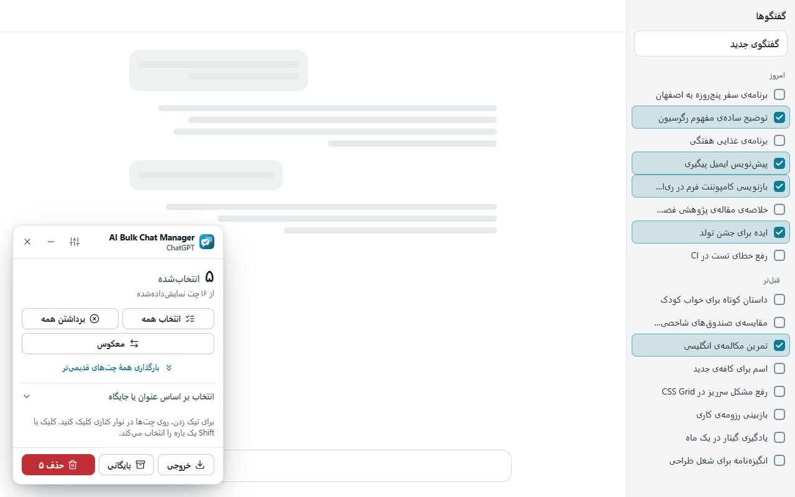

[English](../../README.md) · **فارسی**

# AI Bulk Chat Manager

**چت‌های زیادی را یک‌جا انتخاب کنید و با یک کلیک حذف، بایگانی یا ذخیره کنید.**

افزونه‌ی رایگان و متن‌باز مرورگر برای ChatGPT، Claude، Gemini و Grok. 
فقط روی دستگاه خودتان اجرا می‌شود؛ بدون حساب کاربری، بدون ردیابی، بدون سرور.

## چرا؟

حذف چت‌ها یکی‌یکی یعنی باز کردن منو، زدن حذف، تأیید و تکرار. بعد از چند ماه صدها چت جمع می‌شود. این افزونه کنار هر چت یک چک‌باکس می‌گذارد و یک پنل کوچک داخل صفحه نشان می‌دهد؛ هر چه را نمی‌خواهید تیک می‌زنید و همه را یک‌جا حذف، بایگانی یا خروجی می‌گیرید.

## امکانات

- **پنل شناور داخل صفحه:** هنگام کلیک روی نوار کناری باز می‌ماند، شمارنده‌ی زنده دارد، قابل جابه‌جایی و کوچک‌شدن است.
- **سریع یا مرحله‌به‌مرحله:** حالت سریع مستقیم از خود سایت می‌خواهد؛ اگر نشد (یا خاموشش کنید)، مثل یک آدم منوهای خود سایت را می‌زند.
- **انتخاب به هر روش:** همه، معکوس، بر اساس بخشی از عنوان، قدیمی‌ترین‌ها، کلیک با Shift برای بازه، و «بارگذاری همه‌ی چت‌های قدیمی‌تر».
- **هر بار تأیید می‌کنید:** فهرست دقیق چت‌هایی که تغییر می‌کنند، دکمه‌ی امن در فوکوس، و تیک اضافه برای حذف‌های بزرگ.
- **نتیجه‌ی صادقانه:** نوار پیشرفت، دکمه‌ی توقف، و خلاصه‌ی پایانی. چت‌هایی که ناموفق بودند با دلیلشان انتخاب‌شده می‌مانند تا دوباره تلاش کنید.
- **خروجی گرفتن:** عنوان‌ها و پیوندها را به‌صورت JSON، CSV یا Markdown ذخیره کنید.
- **بایگانی** (در ChatGPT)، حالت روشن و تیره، چهار رنگ تأکید، ۱۱ زبان و چیدمان راست‌به‌چپ.

| سایت | حذف | بایگانی | خروجی |
| --- | :---: | :---: | :---: |
| ChatGPT | ✓ | ✓ | ✓ |
| Claude | ✓ | – | ✓ |
| Gemini | ✓ | – | ✓ |
| Grok | ✓ | – | ✓ |

## نصب

- **Chrome** و مرورگرهای Chromium: [Chrome Web Store](https://chromewebstore.google.com/detail/eppokcmemgiphpegpighpfnhpjggpmoc)
- **Edge:** همان پیوند Chrome Web Store یا بسته‌ی Chrome از [آخرین انتشار](https://github.com/ehsanenaloo/AI-Bulk-Chat-Manager/releases/latest)
- **Firefox** (نسخه‌ی ۱۴۰ به بعد): فایل `…-firefox.zip` از آخرین انتشار را در `about:debugging` به‌صورت موقت بارگذاری کنید، تا زمانی که در Firefox Add-ons منتشر شود.
- **از سورس:** پوشه‌ی `extension/` را به‌صورت Unpacked بارگذاری کنید.

## طرز استفاده

1. ChatGPT، Claude، Gemini یا Grok را باز کنید، روی آیکن افزونه بزنید (یا **Alt+Shift+B**) و «شروع انتخاب چت‌ها» را بزنید.
2. در نوار کناری چت‌ها را تیک بزنید، یا از «انتخاب همه»، فیلتر عنوان، قدیمی‌ترین‌ها یا Shift استفاده کنید.
3. **حذف** را بزنید، فهرست را بررسی و تأیید کنید؛ یا **بایگانی**، یا ابتدا **خروجی** بگیرید.

## حریم خصوصی

همه‌چیز در مرورگر شما اجرا می‌شود؛ سرور، حساب کاربری، آمارگیر، تبلیغ و کد از راه دور ندارد. فقط آنچه فهرست چت نشان می‌دهد (عنوان و پیوند) را می‌خواند، آن هم فقط وقتی انتخاب را شروع کنید؛ متن گفتگوهای شما را هرگز نمی‌خواند. متن کامل: [سیاست حریم خصوصی](../PRIVACY.md) (انگلیسی).

## پرسش‌های پرتکرار

**حذف قابل بازگشت است؟** نه؛ همان حذف خود سایت است. در ChatGPT «بایگانی» از تنظیمات خود ChatGPT برگشت‌پذیر است.

**بعد از به‌روزرسانی سایت کار نکرد.** این سایت‌ها صفحه‌شان را مدام تغییر می‌دهند. افزونه را به‌روز کنید و اگر ادامه داشت با فرم «Site changed» یک issue باز کنید (عنوان چت‌ها را نچسبانید).

**آیا وابسته به OpenAI، Anthropic، Google یا xAI است؟** نه؛ پروژه‌ای مستقل است.

## مشارکت و حمایت

گزارش خطا، اصلاح ترجمه و Pull Request خوش‌آمد است؛ [CONTRIBUTING](../../.github/CONTRIBUTING.md). اگر افزونه وقتتان را گرفت، می‌توانید با یک قهوه حمایت کنید: [buymeacoffee.com/enaloo](https://buymeacoffee.com/enaloo).

مجوز: [MIT](../../LICENSE) © ۲۰۲۶ [Ehsan Enaloo](https://www.enaloo.com)

